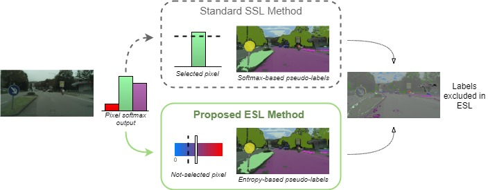

# ESL: Entropy-guided Self-supervised Learning for Domain Adaptation in Semantic Segmentation

## Paper


[ESL: Entropy-guided Self-supervised Learning for Domain Adaptation in Semantic Segmentation](https://arxiv.org/abs/2006.08658)  
 Antoine Saporta, [Tuan-Hung Vu](https://tuanhungvu.github.io/), [Matthieu Cord](http://webia.lip6.fr/~cord/), [Patrick Pérez](https://ptrckprz.github.io/)  
 valeo.ai, France  
 [IEEE Conference on Computer Vision and Pattern Recognition (CVPR) Workshop on Scalability in Autonomous Driving, 2020](https://sites.google.com/view/cvpr20-scalability)

If you find this code useful for your research, please cite our [paper](https://arxiv.org/abs/2006.08658):

```
@misc{saporta2020esl,
    title={ESL: Entropy-guided Self-supervised Learning for Domain Adaptation in Semantic Segmentation},
    author={Antoine Saporta and Tuan-Hung Vu and Matthieu Cord and Patrick P{\'e}rez},
    year={2020},
    eprint={2006.08658},
    archivePrefix={arXiv},
    primaryClass={cs.CV}
}
```

## Abstract
While fully-supervised deep learning yields good models for urban scene semantic segmentation, these models struggle to generalize to new environments with different lighting or weather conditions for instance. In addition, producing the extensive pixel-level annotations that the task requires comes at a great cost. Unsupervised domain adaptation (UDA) is one approach that tries to address these issues in order to make such systems more scalable. In particular, self-supervised learning (SSL) has recently become an effective strategy for UDA in semantic segmentation. At the core of such methods lies `pseudo-labeling', that is, the practice of assigning high-confident class predictions as pseudo-labels, subsequently used as true labels, for target data. To collect pseudo-labels, previous works often rely on the highest softmax score, which we here argue as an unfavorable confidence measurement. In this work, we propose Entropy-guided Self-supervised Learning (ESL), leveraging entropy as the confidence indicator for producing more accurate pseudo-labels. On different UDA benchmarks, ESL consistently outperforms strong SSL baselines and achieves state-of-the-art results.

## Preparation

### Pre-requisites
* Python 3.7
* Pytorch >= 0.4.1
* CUDA 9.0 or higher

### Installation
0. Clone the repo:
```bash
$ git clone https://github.com/valeoai/ESL
$ cd ESL
```

1. Install OpenCV if you don't already have it:

```bash
$ conda install -c menpo opencv
```

2. Install this repository and the dependencies using pip:
```bash
$ pip install -e <root_dir>
```

With this, you can edit the ESL code on the fly and import function 
and classes of ESL in other project as well.

3. Optional. To uninstall this package, run:
```bash
$ pip uninstall ESL
```

You can take a look at the [Dockerfile](./Dockerfile) if you are uncertain about steps to install this project.

### Datasets
By default, the datasets are put in ```<root_dir>/data```. We use symlinks to hook the ESL codebase to the datasets. An alternative option is to explicitlly specify the parameters ```DATA_DIRECTORY_SOURCE``` and ```DATA_DIRECTORY_TARGET``` in YML configuration files.

* **GTA5**: Please follow the instructions [here](https://download.visinf.tu-darmstadt.de/data/from_games/) to download images and semantic segmentation annotations. The GTA5 dataset directory should have this basic structure:
```bash
<root_dir>/data/GTA5/                               % GTA dataset root
<root_dir>/data/GTA5/images/                        % GTA images
<root_dir>/data/GTA5/labels/                        % Semantic segmentation labels
...
```

* **Cityscapes**: Please follow the instructions in [Cityscape](https://www.cityscapes-dataset.com/) to download the images and validation ground-truths. The Cityscapes dataset directory should have this basic structure:
```bash
<root_dir>/data/Cityscapes/                         % Cityscapes dataset root
<root_dir>/data/Cityscapes/leftImg8bit              % Cityscapes images
<root_dir>/data/Cityscapes/leftImg8bit/val
<root_dir>/data/Cityscapes/gtFine                   % Semantic segmentation labels
<root_dir>/data/Cityscapes/gtFine/val
...
```

### Pre-trained models
Pre-trained models can be downloaded [here](https://github.com/valeoai/ADVENT/releases) and put in ```<root_dir>/pretrained_models```

## Running the code
For evaluation, execute:
```bash
$ cd <root_dir>/advent/scripts
$ python test.py --cfg ./configs/advent_pretrained.yml
```

### Training
For the experiments done in the paper, we used pytorch 0.4.1 and CUDA 9.0. To ensure reproduction, the random seed has been fixed in the code. Still, you may need to train a few times to reach the comparable performance.

By default, logs and snapshots are stored in ```<root_dir>/experiments``` with this structure:
```bash
<root_dir>/experiments/logs
<root_dir>/experiments/snapshots
```

To train AdvEnt:
```bash
$ cd <root_dir>/advent/scripts
$ python train.py --cfg ./configs/advent.yml
```
To generate ESL pseudo-labels:
```bash
$ cd <root_dir>/advent/scripts
$ python esl.py --cfg ./configs/esl.yml
```

To train AdvEnt with previously generated ESL pseudo-labels:
```bash
$ cd <root_dir>/advent/scripts
$ python train.py --cfg ./configs/esl.yml
```

### Testing
To test AdvEnt:
```bash
$ cd <root_dir>/advent/scripts
$ python test.py --cfg ./configs/advent.yml
```

To test AdvEnt trained with ESL pseudo-labels:
```bash
$ cd <root_dir>/advent/scripts
$ python test.py --cfg ./configs/esl.yml
```

## Acknowledgements
This codebase is heavily borrowed from [AdvEnt](https://github.com/valeoai/ADVENT) and [BDL](https://github.com/liyunsheng13/BDL).